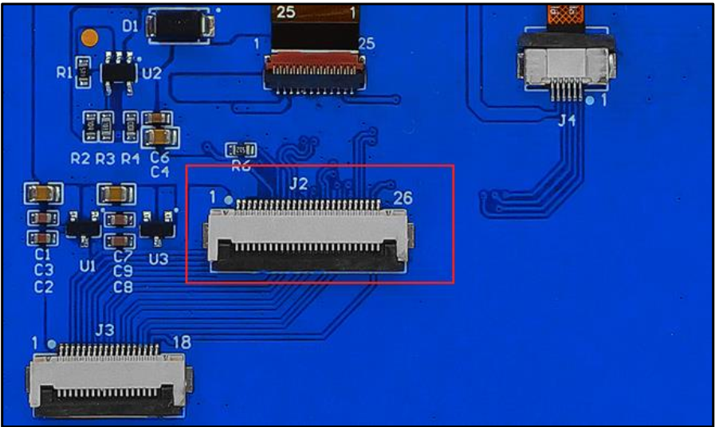
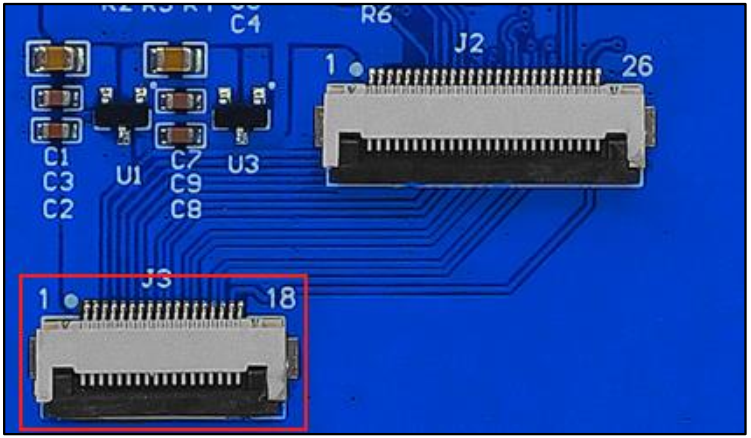
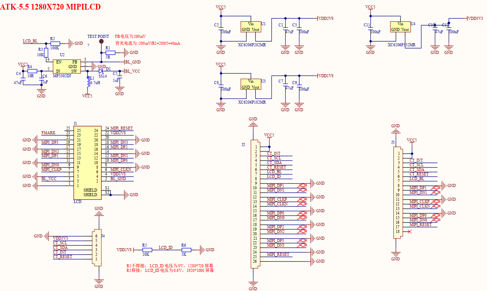

## 1 Introduction

### 1.1 Appearence

The ATK-MD0550 module looks like this:

### 1.2 Features

ATK-MD0550-7201280 is a high-performance 5.5 inch MIPI interface capacitive touch screen module launched by ALIENTEK.The resolution of the module is 720*1280 portrait screen (60 frames), and the corresponding model is ATK-MD0550-7201280.

ATK-MD0550-7201280 is suitable for the ALIENTEK development platform, using ALIENTEK custom data interface, MIPI interface adopts 26pin FPC socket and 18pin FPC socket, which can be directly used for ALIENTEK ATK-DLRV1126 and so on development board.

### 1.3 Parameter

The basic features are described as follows.

| Product model number | ATK-MD0550-7201280                          | Dimensions of form   | 74*150mm²         |
| -------------------- | ------------------------------------------- | -------------------- | ----------------- |
| Product model number | 5.5 inch                                    |                      |                   |
| Resolution           | 720*1280@60fps,portrait screen              | Contrast ratio       | 600（min）        |
| Brightness           | 200 cd/m²(min) 240 cd/m²(typical value) | Backlight type       | LED(white 14*LED) |
| Driver IC            | HX8394F                                     | Interface type       | MIPI interface    |
| Effective area       | 68.04*120.96mm² （Width * height）      | Visual Angle of view | IPS               |
| Supporting equipment | ATK-DLRV1126                                | Color                | 16.7M             |
| Color format         | RGB888                                      | Depth of color       | 24 bits(max)      |

The interface features are described as follows.

| pin number of pins | 18 pin(2 Lanes) or 26 pin(4 Lanes)          | Pin spacing       | 0.5mm                   |
| ------------------ | ------------------------------------------- | ----------------- | ----------------------- |
| Interface function | MIPI DSI (4 Lanes), touch I2C, power supply | Connection method | FPC(Plug and drop type) |

The touch features are described as follows.

| Touch chip             | GT911(The actual chip screen printing shall prevail) | Touch interface | I2C              |
| ---------------------- | ---------------------------------------------------- | --------------- | ---------------- |
| Number of touch points | 5 point capacitive touch                             | Touch type      | Capacitive touch |

The electrical characteristics are described as follows.

| Voltage of module | 5V       | I/O levels      | 1.8V or 3.3V |
| ----------------- | -------- | --------------- | ------------ |
| Power consumption | 5V 280mA | Backlight level | 3.3V         |

The temperature parameters are as follows.

| Operating temperature | -20℃~+70℃ | Storage temperature | -30℃~+80℃ |
| --------------------- | --------- | ------------------- | --------- |

### 1.4 Interface

ATK-MD0550-7201280 has a **26Pin FPC interface** and an **18Pin FPC interface**. 26Pin interface contains four-channel MIPI DSI, touch, and power supply pins that can be used on the ALIENTEK ATK-DLRV1126 development board.

##### 26pin four-wire MIPI DSI interface

| Number | Name  | Notes                                                | IO level                                            |
| ------ | ----- | ----------------------------------------------------------- | ------ |
| 1      | VCC5       | Power supply 5V                                 | 5V       |
| 2      | VCC5       | Power supply 5V                                 | 5V     |
| 3      | CT_INT     | Touch the interrupt signal pin                  | 3.3V                |
| 4      | CT_SCL     | Touch the clock signal pin                      |3.3V                         |
| 5      | CT_SDA     | Touch the data/address signal pin               | 3.3V                          |
| 6   | CT_RST     | Touch the reset signal pin                      | 3.3V                             |
| 7 | LCD_BL     | Screen backlight pin                            | 3.3V                                            |
| 8      | LCD_ID     | Screen ID foot                                  | 1.8V     |
| 9      | GND        | Ground to earth                                 | 0V       |
| 10     | MIPI_DP1   | MIPI DSI channel 1 differential positive signal | 1.8V     |
| 11     | MIPI_DN1   | MIPI DSI channel 1 differential negative signal | 1.8V                                                |
| 12     | GND        | Ground to earth                                 | 0V       |
| 13     | MIPI_CLKP  | MIPI DSI clock differential positive signal     | 1.8V     |
| 14     | MIPI_CLKN  | MIPI DSI clock differential negative signal     | 1.8V                                                |
| 15   | GND        | Ground to earth                                 | 0V       |
| 16     | MIPI_DP0   | MIPI DSI channel 0 differential positive signal | 1.8V                |
| 17     | MIPI_DN0   | MIPI DSI channel 0 differential negative signal | 1.8V |
| 18     | GND        | Ground to earth                                 | 0V |
| 19     | MIPI_DP2   | MIPI DSI channel 2 differential positive signal | 1.8V |
| 20     | MIPI_DN2   | MIPI DSI channel 2 differential negative signal | 1.8V |
| 21     | GND        | Ground to earth                                 | 0V |
| 22     | MIPI_DP3   | MIPI DSI channel 3 differential positive signal | 1.8V |
| 23     | MIPI_DN3   | MIPI DSI channel 3 differential negative signal | 1.8V |
| 24     | GND        | Ground to earth                                 | 0V |
| 25     | MIPI_RESET | Screen reset signal                             | 1.8V |
| 26     | GND        | Ground to earth                                 | 0V |

##### 18pin two-wire MIPI DSI interface

| Number | Name       | Notes                                           | IO level |
| ------ | ---------- | ----------------------------------------------- | -------- |
| 1      | VCC5       | Power supply 5V                                 | 5V       |
| 2      | VCC5       | Power supply 5V                                 | 5V       |
| 3      | CT_INT     | Touch the interrupt signal pin                  | 3.3V     |
| 4      | CT_SCL     | Touch the clock signal pin                      | 3.3V     |
| 5      | CT_SDA     | Touch the data/address signal pin               | 3.3V     |
| 6      | CT_RESET   | Touch the reset signal pin                      | 3.3V     |
| 7      | LCD_BL     | Screen backlight pin                            | 3.3V     |
| 8      | GND        | Ground to earth                                 | 0V       |
| 9      | MIPI_DP1   | MIPI DSI channel 1 differential positive signal | 1.8V     |
| 10     | MIPI_DN1   | MIPI DSI channel 1 differential negative signal | 1.8V     |
| 11     | GND        | Ground to earth                                 | 0V       |
| 12     | MIPI_CLKP  | MIPI DSI clock differential positive signal     | 1.8V     |
| 13     | MIPI_CLKN  | MIPI DSI clock differential negative signal     | 1.8V     |
| 14     | GND        | Ground to earth                                 | 0V       |
| 15     | MIPI_DP0   | MIPI DSI channel 0 differential positive signal | 1.8V     |
| 16     | MIPI_DN0   | MIPI DSI channel 0 differential negative signal | 1.8V     |
| 17     | MIPI_RESET | Screen reset signal                             | 1.8V     |
| 18     | NC         | Hang in the air                                 | -        |

## 2 Schematic

The schematic diagram of the ATK-MD0550 module is shown as follows.

